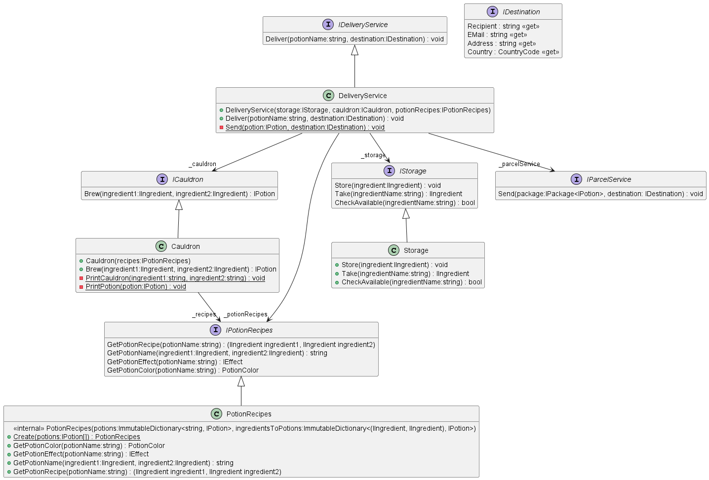
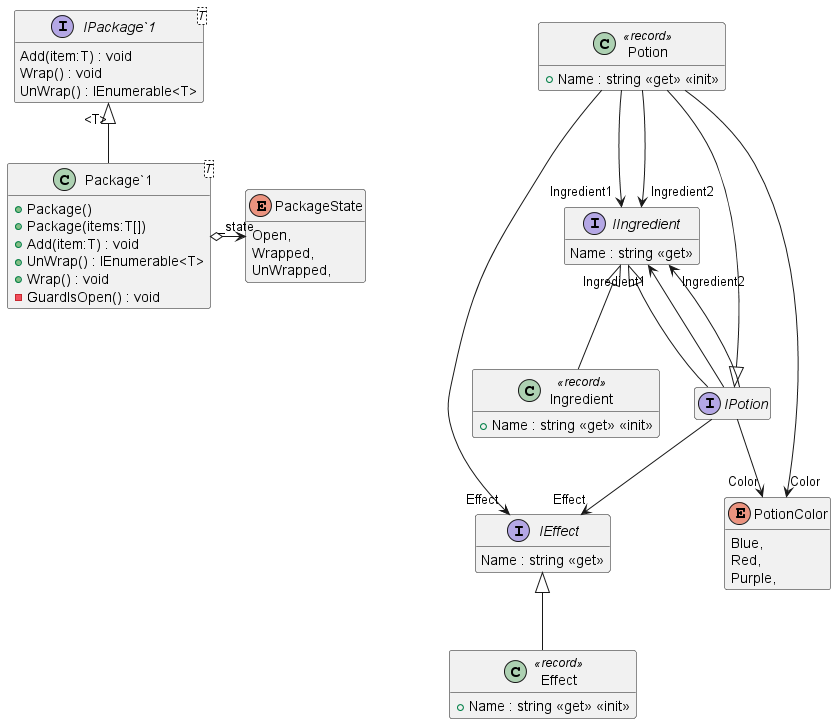

# Potion Delivery Service

This scenario is used to showcase the Twizzar functionality. The Potion Delivery Service works similar to a Pizza Delivery Service expect of pizzas potions get delivered and expect of an oven a cauldron is used to brew the potions.

At the [DeliveryService](DeliveryService.cs) a potion can be delivered by its name to a [Destination](Interfaces/IDestination.cs). The [DeliveryService](DeliveryService.cs) uses the following logic (🔚 Marks a point where the Method returns):
1. Check in the [IStorage](IStorage.cs) if the potion is available.
2. When available:
   1. Take potion form [IStorage](IStorage.cs)
   2. When the potion is of the type [IPotion](Interfaces/IPotion.cs)
      1. Send it to [IDestination](Interfaces/IDestination.cs) 🔚
   3. Else
      1. Throw an InvalidOperationException 🔚
3. When not available
   1. Get the potion ingredients from the [IPotionRecipes](Interfaces/IPotionRecipes.cs)
   2. When the ingredients are not available in the [IStorage](IStorage.cs) then:
      1. Throw an PotionNotAvailableException 🔚
   3. Brew the potion in the [ICauldron](Interfaces/ICauldron.cs)
   4. Send the brewed potion to [IDestination](Interfaces/IDestination.cs) 🔚

## Class Diagram for Services

## Class Diagram for Entities
