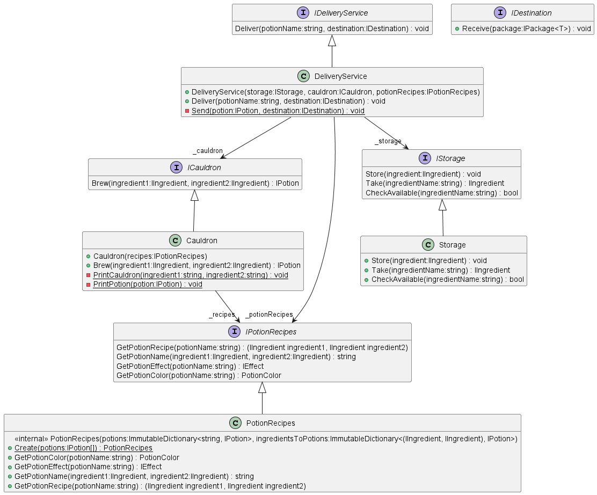
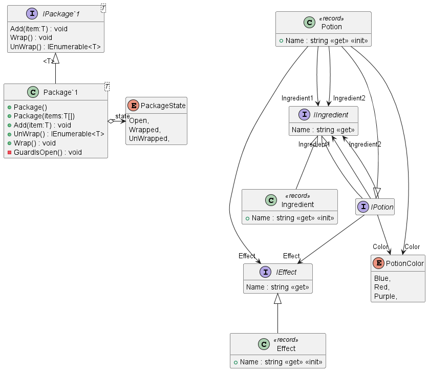

# Potion Delivery Service Example

```
              (
               )  )
           ______(____
          (___________)         
           /         \          
          /           \         
         |             |        ──────▄▌▐▀▀▀▀▀▀▀▀▀▀▀▀▀▀▀▀▀▀▀▀▌
     ____\             /____    ───▄▄██▌█ Potion Delivery
    ()____'.__     __.'____()   ▄▄▄▌▐██▌█ Service
         .'` .'```'. `-.        ███████▌█▄▄▄▄▄▄▄▄▄▄▄▄▄▄▄▄▄▄▄▄▌
        ().'`       `'.()       ▀(⊙)▀▀▀▀▀▀▀(⊙)(⊙)▀▀▀▀▀▀▀(⊙)
```
To get familiar with Twizzar look at the [BaseFeatureTests](PotionDeliveryService.Tests/BaseFeaturesTests.cs).

## Class Diagram for Services

## Class Diagram for Entities
