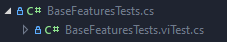

# Potion Delivery Service Example
```
              (
               )  )
           ______(____
          (___________)         
           /         \          
          /           \         
         |             |        ──────▄▌▐▀▀▀▀▀▀▀▀▀▀▀▀▀▀▀▀▀▀▀▀▌
     ____\             /____    ───▄▄██▌█ Potion Delivery
    ()____'.__     __.'____()   ▄▄▄▌▐██▌█ Service
         .'` .'```'. `-.        ███████▌█▄▄▄▄▄▄▄▄▄▄▄▄▄▄▄▄▄▄▄▄▌
        ().'`       `'.()       ▀(⊙)▀▀▀▀▀▀▀(⊙)(⊙)▀▀▀▀▀▀▀(⊙)
```

Welcome to the Potion Delivery Service example. This solution contains the following folder structure:
```csharp
┣━ PotionDeliveryService/       //Code of the Potion Delivery Service Library
┣━ PotionDeliveryService.Tests/ //Unit Tests written with Twizzar
┃  ┣━ BaseFeaturesTests.cs      //Test which explains the base functionality of Twizzar
┃  ┣━ ShowcaseTests.cs          //Tests used to showcase our best Features
┃  ┗━ ...                       //unit test for testing the Potion Delivery Service
┣━ PotionDeliveryService.sln    //The Visual Studio solution for running the example.
┗━ README.md                    //You are currently here
```
For every Test file exist a Twizzard files with the postfix .twizzar. When configuring a type over the Twizzar UI the configurations will be saved in a partial class which resides in the .twizzar file.

In Visual Studio the .twizzar file will be nested under the unit test.  


A good starting point is the [BaseFeatureTests](PotionDeliveryService.Tests/BaseFeaturesTests.cs) or the [ShowcaseTests](PotionDeliveryService.Tests/ShowcaseTests.cs).
```csharp
    [Test]
    public void Build_Items()
    {
        // arrange

        // Builder class for building any type.
        // Helpful for accessing sut and input values for method under test.
        var potion = new ItemBuilder<Potion>().Build();

        // act
        ... your act code

        // assert
        ... your arrange code
    }

    ...
```

Fore more information about the scenarion and class diagramms see [PotionDeliveryService](PotionDeliveryService/).